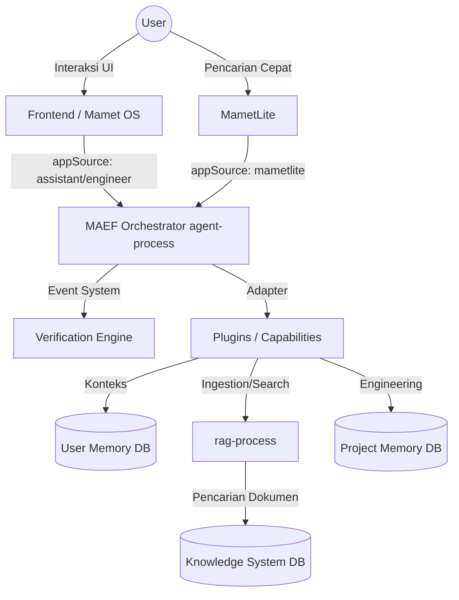

# Laporan Architecture Audit: Mamet OS Ecosystem
Tanggal Audit: 10 Juli 2026 (Ref: 2026-07)

Berdasarkan investigasi terhadap *Constitution*, dokumen *Architecture*, *Roadmap*, dan struktur *Codebase* saat ini, berikut adalah hasil **Architecture Audit** untuk ekosistem Mamet OS.

---

## 1. Struktur Folder (Kedalaman Level 3)

Berikut adalah ringkasan hierarki utama repository (mengabaikan `.git` dan `node_modules`):

```text
ROOT/
├── api/
│   └── memory/
├── backend/ (Legacy Express Runtime)
├── constitution/ (Source of Truth)
├── docs/
│   ├── adr/
│   ├── architecture/
│   ├── blueprints/
│   ├── governance/
│   ├── handoff/
│   ├── monetisasi/
│   ├── project-memory/
│   │   ├── change-log/
│   │   └── discussion-log/
│   ├── roadmap/
│   └── tasks/
├── frontend/ (Full Mamet OS Web & Electron)
│   ├── electron/
│   ├── public/
│   │   └── metadata/
│   ├── release/
│   │   ├── .icon-ico/
│   │   └── win-unpacked/
│   └── src/
│       ├── components/
│       ├── core/
│       └── lib/
├── lib/
├── mametlite/ (Lightweight RAG Client)
│   ├── public/
│   └── src/
│       ├── assets/
│       └── lib/
├── scratch/
├── scripts/
└── supabase/
    └── functions/ (Core MAEF Runtime)
        ├── agent-process/
        ├── backup-export/
        ├── backup-restore/
        ├── check-keys/
        ├── cron-agent/
        ├── debug-cron/
        ├── health-check/
        ├── knowledge-health/
        ├── rag-process/
        ├── test-audit/
        └── test-suite/
```

---

## 2. Daftar Modul Inti & Status Implementasi

| Modul Inti | Peran Utama | Status Implementasi |
|---|---|---|
| **`agent-process`** | MAEF Main Orchestrator (Mengatur capability & intent) | ✅ **Active** (Baru saja di-refactor dari monolith ke modular) |
| **`rag-process`** | Ingestion & Embedding Pipeline dokumen | ✅ **Active** |
| **`frontend`** | *Full-product surface* (Dashboard & Desktop Shell) | ✅ **Active** |
| **`mametlite`** | *Lightweight read-oriented mode* | ✅ **Active** |
| **`backend`** | Legacy backend | ⚠️ **Legacy** (Dipertahankan untuk kompatibilitas, bukan runtime utama) |
| **Verification Engine** | Hard Gate untuk filter Halusinasi & Evasion | ✅ **Active** (Sudah mencakup _Content-based checks_) |
| **Project Memory** | Sumber kebenaran *Engineering* (DB vs Dokumen) | 🔄 **In Progress** (Hybrid DB + File, perlu unifikasi) |

---

## 3. Dependency Graph Antar Modul Utama



---

## 4. Workflow Main Orchestrator Saat Ini

Mengacu pada `14_MAEF_ORCHESTRATOR_SPEC.md`, MAEF Orchestrator bukan *executor* mandiri melainkan bertindak sebagai *coordinator* berbasis **Event Driven Execution**. Alur utamanya:

1. **Intent Received**: Menerima input/intent dari Frontend atau MametLite.
2. **Planning & Task Decomposition**: Memecah intent menjadi task, merencanakan urutan dan *dependency chain*.
3. **Execution (Capability Mapping)**: Memanggil adapter dan plugin yang sesuai (misal: RAG, Coder, Web Scraper).
4. **Verification**: Semua hasil masuk ke `VerificationEngine` sebagai **Hard Gate** (cek halusinasi, evasion, validitas kontrak).
5. **Aggregation**: Menggabungkan hasil AI, tool, dan database menjadi satu.
6. **Response & Learning Update**: Mengirim hasil ke User dan memperbarui *Memory/Knowledge* jika diverifikasi.

---

## 5. Ketersediaan Tool (Capability Plugins)

Berdasarkan isi dari `supabase/functions/agent-process/plugins` dan Konstitusi `02_MAEF_KERNEL`:

**✅ Tool yang Sudah Tersedia:**
- `coder`, `researcher`, `scraper`, `deep_research`
- `shopee_ninja`, `youtube_analyst`, `file_analyzer`
- `context_compressor`, `logic`, `language`, `debate`, `self_healing`
- `cron_manager`, `knowledge_manager`, `memory_manager` & `memory_manager_v1`, `communicator`

**❌ Tool/Capability yang Belum Tersedia (Berupa Konsep di Konstitusi MAEF):**
- *Robot / Vision / Voice*
- *IoT Integration*
- *Automation Workflow Engine & Planning Engine* (Level makro tingkat lanjut)
- *Knowledge Graph* (native)

---

## 6. Statistik Codebase

> [!NOTE]
> *Statistik diambil secara dinamis, mengabaikan node_modules, .git, dan build artifacts.*

- **Jumlah File (Sistem Utama)**: 283 file
- **Lines of Code (LOC)**: ~406,634 baris 
  - *Sebagian besar (~358k) berada pada file `.html` yang kemungkinan besar adalah hasil scrape atau cache.*
  - *TypeScript (.ts)*: 14,255 baris
  - *JavaScript (.js)*: 10,851 baris
  - *JSON*: 22,040 baris
- **Dependency Utama (`package.json`)**: 
  - `@supabase/supabase-js`, `node-fetch`
  - `cheerio`, `duck-duck-scrape`
  - `pdf-parse`, `pdfjs-dist`
  - `youtube-transcript`
- **Bundle Size (`frontend/dist`)**: ~2.02 MB

---

## 7. Bottleneck Performa yang Ditemukan

1. **Siklus Kernel Terikat UI**: Booting Kernel masih dipicu oleh `useEffect` React (`RFC-011`). Ini menyebabkan Kernel OS harus menunggu komponen UI siap, rentan terhadap strict mode *race conditions*.
2. **Ad-Hoc Debouncer (`WorkspaceManager`)**: Limit API saat me-resize layout UI dikelola manual dengan setTimeout, bukan layanan terpusat (`RFC-010`), menyebabkan inefisiensi render UI.
3. **Dangling Promises pada Async Tasks**: Analisis repositori atau sinkronisasi background yang berjalan tanpa scheduler terpusat dapat bocor (*memory leak*) atau gagal dihentikan ketika pengguna berpindah konteks (`RFC-012`).
4. **MametLite ragTopK (GAP-NEW-016)**: MametLite diset dengan `ragTopK=10` sementara versi AI utama hanya `ragTopK=5`. MametLite justru secara tidak intuitif memuat konteks lebih berat dibanding versi full Assistant.

---

## 8. Komponen yang Masih Berupa Konsep / RFC

1. **Kernel-First Bootloader (`RFC-011`)**: Inversi inisialisasi agar Kernel OS berjalan lebih dahulu secara independen dari siklus React.
2. **Task Scheduler Service (`RFC-012`)**: Pengelola antrean latar belakang tingkat OS.
3. **OS-Level Throttle/Debouncer (`RFC-010`)**: Layanan pembatasan *rate limit* untuk UI terpusat.
4. **Self Engineering Lifecycle (GAP-NEW-009)**: Belum adanya implementasi sistem pelacakan letak/posisi Mamet Engineer dalam *State Machine Lifecycle*.
5. **Engineering Metrics Dashboards (GAP-NEW-007, 008)**: 4 dari 9 metrik (seperti *Average Confidence Score*) belum bisa dihitung karena skema DB (`verification_runs`) kekurangan kolom.

---

## 9. Komponen dengan Potensi Overengineering

1. **Project Memory Hybrid (File + DB) (`GAP-NEW-005`)**: Saat ini Project Memory direplikasi dalam bentuk Dokumen Markdown (di `docs/project-memory/`) dan Data di Database. Kurangnya API persatuan bisa menyebabkan asinkronisasi data, membingungkan AI Engineer untuk menentukan *Single Source of Truth*.
2. **Legacy `backend/` Folders**: Menahan folder *backend* berbasis Express lama hanya demi kompatibilitas akan mendatangkan *technical debt* dan overhead maintenance ketika *edge functions* di Supabase sudah berperan sebagai arsitektur utama.
3. **Two-Brain Context Model (GAP-NEW-011)**: Saat ini hanya berlaku bagi profil/mode `ENGINEER`. Jika dibiarkan silo, Assistant mode pada akhirnya kehilangan manfaat konteks statis yang solid.

---

## 10. Rekomendasi Prioritas Pengembangan (6 Bulan ke Depan)

Untuk menjaga Mamet OS tetap cepat, modular, dan realistis bagi Mamet Coder, berikut urutan prioritasnya:

> [!IMPORTANT]
> **Prioritas Tinggi (Bulan 1-2): Fondasi Stabilitas OS & Metrik**
> 1. **Eksekusi RFC-011 (Kernel-First Bootloader)**: Lepaskan Kernel dari UI. Ini akan secara drastis meningkatkan *perceived performance* (kecepatan respon awal) dan stabilitas.
> 2. **Unifikasi Project Memory (GAP-NEW-005)**: Pilih satu jalur utama (lebih baik DB) dan buat interface standar agar Mamet Coder tidak berhalusinasi saat mencari konteks histori.
> 3. **Implementasi Skema DB Metrics (GAP-NEW-008)**: Tambahkan kolom `confidence_score` dsb. Mamet Coder butuh _feedback loop_ agar bisa terus berkembang menjadi AI Software Engineer mandiri.

> [!TIP]
> **Prioritas Menengah (Bulan 3-4): Manajemen Sumber Daya (Cegah Overload)**
> 4. **Task Scheduler (RFC-012) & Debouncer (RFC-010)**: Terapkan Service Scheduler agar *background task* (scraping, indexing RAG) tidak mencekik performa Main Thread dari UI OS pengguna.
> 5. **Normalisasi RAG Top K (GAP-NEW-016)**: Investigasi dan kembalikan MametLite ke beban yang paling minimal agar sesuai visinya sebagai klien *read-only* yang super cepat.

> [!WARNING]
> **Prioritas Lanjut (Bulan 5-6): Kebersihan Arsitektur**
> 6. **Deprekasi Total Legacy Backend**: Potong jalur ke `backend/` untuk mencegah "Two Runtime Problem" dan hapus seluruh sisa file lawas.
> 7. **Implementasi Self Engineering Lifecycle**: Buat *State Machine* jelas (Planning -> Implement -> Verify) untuk mode ENGINEER sehingga iterasi otomatis *Agentic Coder* bisa terukur. 
