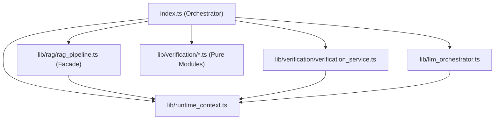

# Mamet AI Architecture Gate Review (Post Wave 5.2E.2)

## 1. Dependency Graph Audit

**Status:** 🟢 STABLE

**Findings:**
- **Zero Circular Dependency**: Confirmed.
- **Zero Cross Import**: RAG and Verification do not import each other. Data passing is strictly done via DTO contracts in `index.ts`.
- **Zero Hidden Dependency**: `RuntimeContext` injection is fully operational.
- **Closure Leaks**: Background tasks are now safely encapsulated in `rctx.tasks.fire()`.

---

## 2. Public API Audit

**Status:** 🟡 PARTIAL COMPLIANCE

**RAG Domain (✅ PASS):**
- Strictly uses Facade pattern. `index.ts` only knows `executeRagPipeline()`.
- Internal helpers (`document_search`, `embedding`) do not leak.

**Verification Domain (❌ FAIL):**
- **Issue:** `verification_pipeline.ts` **TIDAK DITEMUKAN** (Belum diimplementasikan).
- Akibatnya, `index.ts` masih mengorkestrasi seluruh langkah verifikasi secara manual:
  - `validateEvidence()`
  - `getActiveConflictsCount()`
  - `calculateConfidence()`
  - `buildUniversalContract()`
  - `persistEvidenceAuditLog()`
- API internal bocor secara langsung ke Orchestrator.

---

## 3. RuntimeContext Audit

**Status:** 🟢 CLEAN

| Field | Penggunaan Saat Ini | Status | Rekomendasi |
| :--- | :--- | :--- | :--- |
| `keys` | Resolusi Provider API Key | ✅ Diperlukan | Pertahankan. |
| `model` | Penentuan LLM target | ✅ Diperlukan | Pertahankan. |
| `policy` | Cek akses *desktop tools* | 🟡 Minimalis | Perluasan fitur policy (RBAC). |
| `stream` | Setup SSE Streaming | ✅ Diperlukan | Pertahankan. |
| `logger` | `api_usage` & `agent_logs` | ✅ Diperlukan | Pertahankan. |
| `state` | Akumulasi error model LLM | 🟡 Redundan? | Gabungkan dengan `UnifiedExecutionContext` jika memungkinkan, atau pisahkan batas yang jelas antara State Aplikasi vs State Infrastruktur. |
| `tasks` | Background async execution | ✅ Sangat Kritis | Pertahankan. |
| `env` | Koneksi Supabase | ✅ Diperlukan | Pertahankan. |

---

## 4. index.ts Responsibility Audit

**Status:** 🔴 MONOLITH ALERT

- **LOC Saat ini:** ~1163 baris (turun drastis dari 2000+, namun masih masif).
- **Top Level Functions:** 3 (`getActiveKey`, `getAllKeys`, `serve`).
- **Remaining Responsibilities di dalam `serve()`:**
  - HTTP Entry / CORS Guard (L1-100)
  - Auth, Session & RBAC Binding (L100-250)
  - Quota Checking (L300-350)
  - Execution Loop & Routing (L350-1000)
  - Verification Orchestration (L600-900)
  - Stream Serialization (L1000-1163)

---

## 5. Verification Domain Audit

**Status:** 🟡 INFRASTRUCTURE & PURE LOGIC EXTRACTED, ORCHESTRATION PENDING

- Direktori `lib/verification/` **Sangat Bersih**. Leaf module (`confidence_engine.ts`, `policy_engine.ts`, `evidence_validator.ts`) adalah *pure function* (100% testable).
- Infrastruktur (`verification_service.ts`) terisolasi dengan baik.
- **Kekurangan Utama:** Tidak ada Facade. Seluruh domain Verification membebani memori kerja `index.ts`.

---

## 6. RAG Domain Audit

**Status:** 🟢 EXCELLENT

- RAG Pipeline beroperasi secara independen.
- Tidak terjadi *coupling* dengan Verification layer.
- Pembaruan `RagPipelineResult` untuk mengekspor `memoryPrompt` berhasil menjaga integritas *Universal Contract* tanpa membocorkan logika internal.

---

## 7. Remaining Monolith Analysis

Sisa blok besar di `index.ts` yang perlu dipecah:

| Komponen | Estimasi LOC | Risiko Refactor | Prioritas |
| :--- | :--- | :--- | :--- |
| **Verification Orchestration** | ~300 | Sedang | Sangat Tinggi |
| **Auth & Request Parsing** | ~250 | Tinggi | Menengah |
| **LLM Execution Loop (Fallback/Retry)** | ~200 | Tinggi | Tinggi |
| **Workspace / Tool Handoff** | ~150 | Sedang | Menengah |

---

## 8. Technical Debt Audit

- **Verification Facade Absence:** Ini menyebabkan `index.ts` mengetahui urutan pasti dari *Evidence Gate -> Conflict Check -> Confidence Score -> Universal Contract -> Logging*. Urutan ini rentan rusak jika `index.ts` dimodifikasi.
- **Auth DB Queries:** `createClient` untuk Auth masih tertanam di dalam siklus HTTP request awal.
- **Quota DB Queries:** Pengecekan *daily quota* melalui `.rpc()` masih ter-hardcode di dalam `index.ts`.
- **Model Fallback:** Logika *retry/fallback* ke Groq/OpenRouter tertulis prosedural di dalam `index.ts`, seharusnya menjadi domain `llm_orchestrator.ts`.

---

## 9. ADR Compliance

| ADR | Deskripsi | Skor Kepatuhan | Catatan |
| :--- | :--- | :--- | :--- |
| **ADR-0008** | Memory Management System | **90%** | Queued writes & isolated reads beroperasi sempurna. |
| **ADR-0009** | Zero Behavioral Change Extraction | **85%** | RAG 100% selesai. Verification mandek di Orchestration. |
| **ADR-0010** | Deterministic Confidence Scoring | **100%** | 100% dikalkulasi di backend (tanpa LLM bias). |

---

## 10. Extraction Priority (Rencana Eksekusi Lanjutan)

1. **Wave 5.2E.3 — Verification Facade (Prioritas Utama)**
   - **Estimasi:** 300 LOC.
   - **Alasan:** Menyelesaikan ADR-0009 untuk Verification Domain. Membuat `executeVerificationPipeline()` yang merangkum *evidence gate*, *confidence*, *policy*, dan *audit*.
2. **Wave 5.2F — Request Pipeline & Middleware**
   - **Estimasi:** 250 LOC.
   - **Alasan:** Ekstraksi Auth, JWT, CORS, dan Quota Check menjadi middleware terpisah.
3. **Wave 5.2G — LLM Coordinator Flow**
   - **Estimasi:** 200 LOC.
   - **Alasan:** Memindahkan loop *retry*, penanganan error model, dan *fallback* dari `index.ts` ke dalam `llm_orchestrator.ts`.

---

## 11. Final Score

- **Architecture Score:** `7.5 / 10` *(Menuju Facade Pattern yang matang, tersendat di Verification Orchestration)*
- **Maintainability Score:** `8.5 / 10` *(Domain murni sangat mudah dibaca dan di-test)*
- **Technical Debt Score:** `6.5 / 10` *(Beban kognitif pada `index.ts` masih cukup tinggi)*
- **Readiness Score:** `9.0 / 10` *(Zero Regression terpenuhi, sistem aman untuk production running)*

**Rekomendasi Utama:** Segera laksanakan **Wave 5.2E.3** untuk membungkus Domain Verification ke dalam `verification_pipeline.ts` sebelum beralih ke ekstraksi komponen lain.
