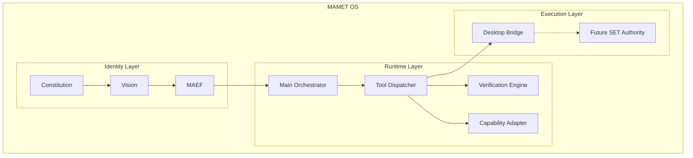

# MAMET OS EVOLUTION CHRONICLE
Date:
2026-07-11

---

# 1. Executive Summary

Hari ini menandai pergeseran fundamental dalam tata kelola Mamet OS. Tema utamanya adalah:
**"Perjalanan Mamet dari AI Assistant menuju Intelligence Operating System dengan Execution Governance."**

Pengembangan tidak lagi berfokus pada kecerdasan model semata, melainkan pada pengendalian (governance), observabilitas, dan penegakan perlindungan sistem operasi. Sesi rekayasa (*engineering block*) hari ini mengeksekusi integrasi **Self-Engineering Lifecycle (RFC-014)**, **Single Tool Dispatcher (RFC-015)**, serta menginisiasi persiapan arsitektural masa depan melalui **RFC-016**.

---

# 2. Initial Architecture State

Kondisi awal sebelum intervensi hari ini adalah arsitektur **Hybrid Authority Model**:
- LLM secara otonom menghasilkan instruksi dan memformatnya sebagai *Function Call* JSON atau tag XML.
- `stream_handler.ts` (Stream Handler) meneruskan *output* asinkron tersebut secara mentah kepada klien.
- Desktop Svelte memegang hak eksekusi lokal penuh. Frontend mendengarkan *stream* dan langsung menjalankan alat operasi sistem (*file/shell*).
- **Risiko Terbuka:**
  - *Rogue edits:* LLM dapat mengubah *state* sistem tanpa filter arsitektural.
  - *Frontend bypass:* Serangan injeksi jaringan atau manipulasi DevTools dapat memerintahkan eksekusi tanpa persetujuan orkestrator.
  - *Hallucinated tool calls:* Klien buta terhadap fase *engineering* dan akan mengeksekusi alat meski agen sedang berada pada fase diskusi/proposal.
  - Kehilangan *Owner Sovereignty:* Keputusan eksekusi dievaluasi jauh dari otoritas *Backend*.

Hubungan dengan inisiatif saat ini:
- **RFC-014 (Engineering Lifecycle):** Memerlukan kepatuhan fase sebelum alat dijalankan.
- **RFC-015 (Single Tool Dispatcher):** Solusi untuk membendung celah bypass.
- **GAP-NEW-019:** Catatan defisit arsitektur terhadap perlindungan eksekusi *hard gate*.

---

# 3. RFC-015 Tool Dispatcher Implementation History

## Phase 1-2 Shadow Mode

Implementasi menetapkan `ToolDispatcher` sebagai *choke point* sentral untuk seluruh sub-agent (melalui `tool_subscriber.ts`).

Alur Eksekusi (Shadow Mode):
LLM
↓
Tool Dispatcher
↓
Policy Evaluation
↓
Execution Observation

Catatan Implementasi:
- **Shadow Mode activation:** Alih-alih membatalkan eksekusi, dispatcher membiarkan eksekusi aktual berlanjut. Keputusan dicatat hanya sebagai bukti untuk observasi masa depan.
- Status respons yang dicatat:
  - `ALLOW`
  - `WOULD_DENY`
  - `WOULD_REQUIRE_APPROVAL`

---

# 4. Security Hardening Changes

Dalam proses *review* dan verifikasi *Shadow Mode*, kami mengidentifikasi celah internal dan segera mengimplementasikan arsitektur penahanan (*Security Hardening*):

## RuntimeContext Protection
- **Sebelum:** Terdapat kemungkinan `rctx` dan objek konteks utamanya bernilai *null*, dan ketika terjadi kesalahan internal, agen jatuh ke mode *fail-open*.
- **Sesudah:** Strict validation telah diterapkan di awal proses, dibungkus di dalam *try-block*. Ketiadaan konteks akan segera memicu blokir permanen: `DENY_ON_INTERNAL_ERROR`.

## Recursive Dispatch Protection
- **Sebelum:** Perlindungan re-entransi (plugin memanggil plugin) menggunakan semafor boolean global `_isDispatching`. Hal ini menggagalkan eksekusi *nested* yang valid.
- **Sesudah:** Diganti menggunakan metrik kedalaman dengan properti `_dispatchDepth`.
- **Dengan:** `MAX_DISPATCH_DEPTH = 5`.
- **Alasan:** Perubahan ini mempertahankan fleksibilitas hierarki *subagent* (mendukung *nested dispatch*) sembari mengamankan sistem dari potensi *infinite recursion* yang mengonsumsi seluruh memori (*Stack Overflow*).

---

# 5. Risk Gate Evolution

Kebijakan *blacklist* `ToolDispatcher` telah diperluas. Penambahan ini tidak dirancang sebagai pengganti *sandbox*, melainkan sebagai **early detection layer** yang ringan dan deterministik sebelum *payload* mencapai shell pengguna.

Daftar vektor baru (*pattern*) yang dihadang:

*Command destruction:*
- `rm -rf`
- `rm -r`
- `del /s /q`
- `format`
- `Remove-Item`
- `rmdir`
- `shred`
- `dd`

*Filesystem:*
- `os.remove`
- `shutil.rmtree`

*Payload Encapsulation:*
- `base64`
- `certutil`

*Network Downloader:*
- `wget`
- `curl`

*Command Chaining:*
- `&&`
- `||`
- `;`
- `|`

---

# 6. Telemetry Architecture

Untuk mendukung observabilitas *Shadow Mode*, arsitektur telemetri telah ditanamkan ke dalam inti operasi.

- **Database:** Dikirim menuju relasi sentral `agent_logs`.
- **Event:** Tercatat dengan *signature* `TOOL_DISPATCHER_AUDIT`.
- **Migration:** Untuk melindungi skalabilitas saat volume log melonjak, skrip database `idx_agent_logs_dispatcher_audit` telah diciptakan.
- **Tujuan Telemetry:**
  - Mengukur performa *shadow metrics*.
  - Melakukan analisa *false positive* sebelum *Hard Enforcement* diberlakukan.
  - Memastikan *enforcement readiness*.

---

# 7. Engineering Metrics Achievement

Status penyelesaian metrik rekayasa.
- **GAP-NEW-007:** Resolved ✅

Perubahan struktural pada database untuk mendukung *Derived Metrics*:
- Tabel `engineering_tasks`: ditambah kolom `patch_accepted`
- Tabel `verification_audit_logs`: ditambah kolom `review_confirmed`
- Tabel `project_memory_entries`: ditambah kolom `bug_category`

Pencapaian "9 Engineering Metrics Dashboard":
1. Patch Acceptance Rate
2. Recurring Bug Rate
3. Review Accuracy
4. Average Confidence
5. Verification Pass Rate
6. Task Completion Rate
7. MTTR
8. Architecture Gap Closure Rate
9. Engineering Knowledge Growth Rate

**Catatan Hasil Analisis Aktual:**
Kueri atas metrik `Engineering Knowledge Growth Rate` membuktikan nilai *new_entries_30d = 15*. Keberadaan 15 riwayat memori proyek baru membuktikan bahwa *Project Memory* sudah aktif dan berfungi mengakumulasi insting dan regulasi sistem.

---

# 8. Phase 3 Stream Interceptor

Implementasi *Shadow Mode* selanjutnya bergeser ke ranah Desktop Stream.
- **Modul:** `stream_handler.ts`
- **Konsep Dasar:** *Latency-Zero Shadow Analysis* (Menganalisa tanpa menambah latensi komunikasi *chat*).

**Flow Intersepsi:**
LLM Stream
↓
Frontend Streaming
↓
Buffer Response
↓
Detect Tool Intent
↓
ToolDispatcher Audit

**Detektor Ekspresi:**
1. Pola kustom `<terminal>`
2. Pola *markdown* `JSON tool blocks`

**Catatan Integrasi:**
Sesuai arsitektur *Shadow Mode*, aliran *Stream Interceptor* hanya berfungsi untuk merangkum dan mengevaluasi aktivitas pasca-rekonstruksi. Sistem masih belum melangsungkan intervensi blokir absolut.

---

# 9. RFC-016 Backend Authoritative Execution Architecture

Sebuah proposal arsitektur fundamental telah lahir:
**RFC-016 Backend Authoritative Execution Architecture**

- **Masalah:** Desktop masih memegang kedaulatan (*authority*). Backend yang sekadar melakukan audit (*shadow mode*) hanya mengetahui serangan tanpa kemampuan memitigasi eksekusi asli di perangkat pengguna.
- **Target:** Membangun *Backend Authoritative Model*.

**Architecture:**

*CURRENT:*
LLM
↓
Stream Handler
↓
Desktop
↓
Execution

*FUTURE:*
LLM
↓
ToolDispatcher
↓
Policy Engine
↓
Signed Execution Token
↓
Desktop Executor

---

# 10. Signed Execution Token Concept

Dalam proposal RFC-016, otorisasi tak lagi bersifat asimetris.

**SET Purpose:**
- *Cryptographic authorization* terhadap eksekusi perintah LLM.
- *Prevent rogue execution* (menghapus ancaman *DevTools injection* / *Man-in-the-Middle*).
- *Preserve Owner Sovereignty* (hanya Owner yang berhak memberi izin terbitnya token lewat status).

Sebagai efek dari pergeseran ini, sifat dari antarmuka Svelte (Desktop) akan berubah menjadi:
**"Dumb Execution Terminal"**

Desktop tidak diperkenankan lagi menjalankan format instruksi konvensional seperti *raw JSON tool* atau *raw terminal command*. Eksekusi hanya diproses saat menerima token kriptografik tervalidasi:
`<execute token="valid">`

---

# 11. Architecture Decisions Made Today

- **DECISION-001:** *Shadow Mode dipertahankan.*
  - **Reason:** Perlunya sampel data dan metrik empiris terhadap metrik *False Positive* sebelum mengubah perilaku infrastruktur klien.
- **DECISION-002:** *Phase 4 Hard Enforcement ditunda.*
  - **Reason:** Pemotongan otoritas Desktop menuju Backend (perubahan hak komputasi aktual) adalah modifikasi teritorial fundamental, melampaui urgensi *observability* (fase 1-3).
- **DECISION-003:** *RFC-016 dibuat sebagai RFC terpisah.*
  - **Reason:** Transisi arsitektur Otoritas Backend terlalu kompleks untuk dimasukkan di bawah bendera ToolDispatcher (RFC-015), dan membutuhkan tinjauan teknis serta dokumentasi lintas-platform terpisah.

---

# 12. Remaining Open Gaps

Fokus pasca-iterasi ini.

- **GAP-NEW-009:** Self Engineering Lifecycle
  - *Status:* IN PROGRESS
- **GAP-NEW-019:** Tool Dispatcher & Hard Gate Centralization
  - *Status:* OPEN / TRANSITIONING
- **GAP-NEW-015:** Circuit Breaker Configuration
- **GAP-NEW-016:** MametLite RAG TopK Review
- **GAP-NEW-017:** LLM Provider Documentation
- **GAP-NEW-018:** Documentation Integration

---

# 13. Lessons Learned

Wawasan filosofis dan teknis yang direngkuh hari ini:

1. **AI Agent tidak cukup memiliki intelligence.** Ia membutuhkan governance. Sistem cerdas yang tak terkontrol tak ubahnya malware dengan akses penuh.
2. **LLM bukan authority.** LLM hanyalah reasoning engine, ia memprediksi kemungkinan, ia tidak menentukan izin operasi eksekusi.
3. **Execution harus lebih ketat daripada generation.** LLM dibebaskan berhalusinasi, namun filter eksekusi (*ToolDispatcher*) harus menghentikan halusinasi destruktif tanpa toleransi kompromi.
4. **Memory, verification, policy, dan execution control adalah fondasi AI OS.** Kecerdasan adalah bonus di atas landasan *Trust*, keamanan, dan auditabilitas.
5. **Shadow Mode diperlukan sebelum enforcement.** Penegakan keras sepihak memecah (*break*) arus kerja. *Telemetri pasif* memungkinkan transisi presisi.

---

# 14. Current Mamet OS Architecture Snapshot

---

# 15. Final Historical Statement

"2026-07-11 menjadi titik perubahan ketika Mamet OS mulai bergerak dari sistem AI Assistant menuju Intelligence Operating System dengan governance, verification, telemetry, dan controlled execution."
